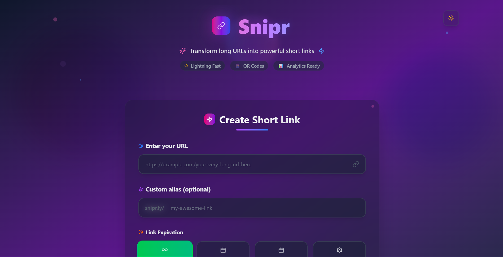
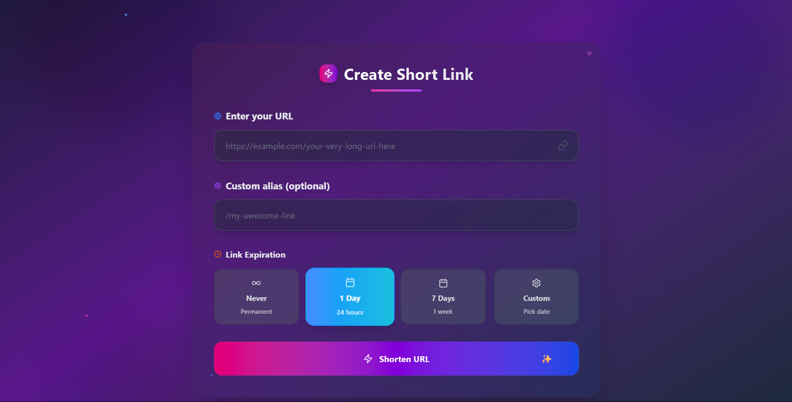

# 🔗 Snipr

Snipr is a sleek, secure, and smart URL shortener built with Node.js, Express, Firebase, and React. It lets you shorten long URLs, customize aliases — all with optional expiration, downloadable QR codes, and easy link sharing.

---

## 🚀 Features

- ✂️ **Shorten URLs** — Create short links for long, messy URLs.
- 🧩 **Custom Aliases** — Use your own branded slugs.
- ⏳ **Link Expiry** — Set expiration for 1 day, 7 days, custom, or never.
- 📸 **QR Code Generation** — Instantly generate and **download** QR codes for any short URL.
- 🔗 **Link Sharing** — Easily share links via copy, social, or device-native share menu.
- ⚙️ **Daily Cleanup** — Automatic deletion of expired URLs (3 AM UTC).
- 🛡 **Rate-Limited & Secure** — Helmet, CORS, and Redis-based limits.
- 🌐 **Frontend + Backend** — Seamlessly integrated React + Express.
- 🧪 **Fully Tested** — With Jest and Supertest.

---

## 📸 Screenshots

  
   
  

